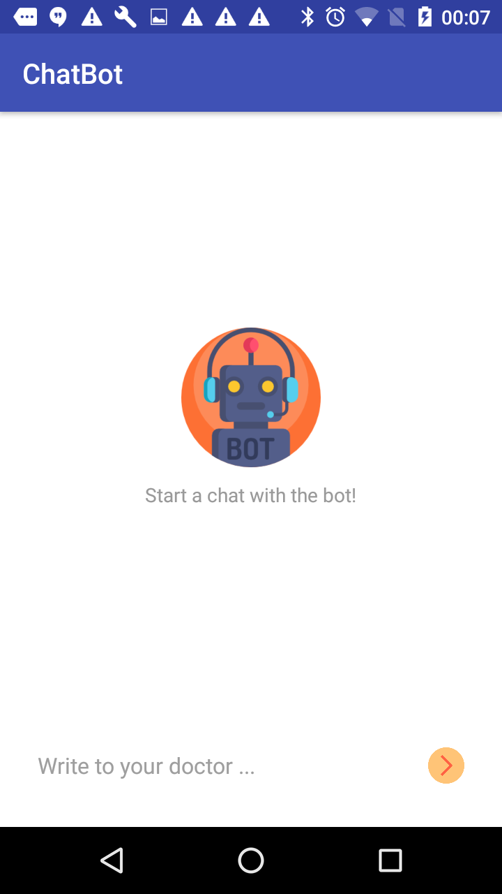
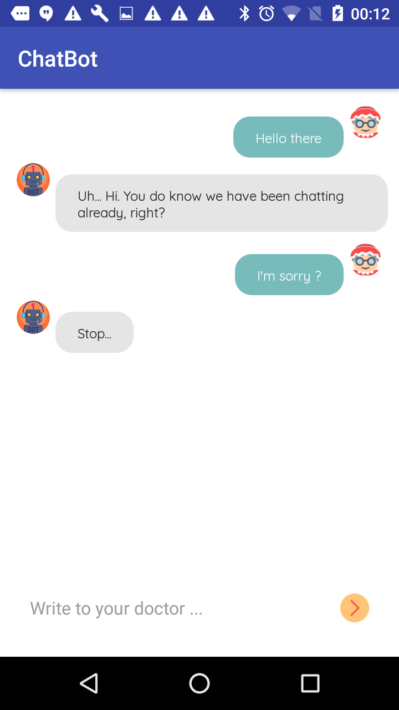
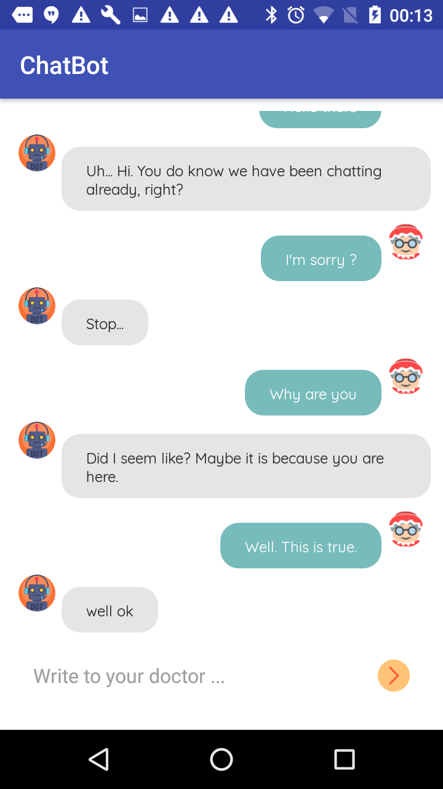
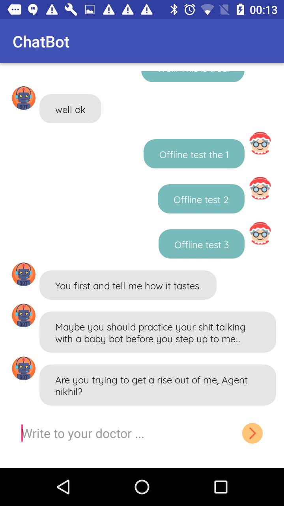

## Version 1 - Basic
    
    

## Version 2 - Persist on Restart

## Version 3 - Retry on Internet
     

### Views 
* Singular Activity - ChatActivity (thin Activity only responsible for UI updates).
* RecyclerView Adapter - ChatAdapter
* RecyclerView Items - ChatViewHolder

### Data Model
* Simple Chat data POJO - ChatMessageContainer, ChatMessageData
* Single conversation POJO - ChatThread

### Controllers
* NetworkController - with static methods of POST/GET Volley requests
* Router - Currently simple but can be extended for more functionality
* ChatActivityController - acts as a presenter in the MVP pattern. Can be implemented as an actual Presenter using Injection later.

### Persistence Mechanism
* SharedPreferencesController - Singleton
* Assumption: Data stays simple with 2,3 variables only
* Extended message functionality like forward, delete, reply etc. are not required in the assignment
* Extended data functionality like searching, sorting are not required in the assignment

### Libraries Used 
* Butterknife
* Volley
* CircularImageView

### Possible Sources of Bugs
* JSON parsing - not accounting for 'optional' variables
* Unit testing - an actual MVP pattern would have made modules easier to unit test
* Have not yet implemented going-away of keyboard on scrolling the RecylerView
